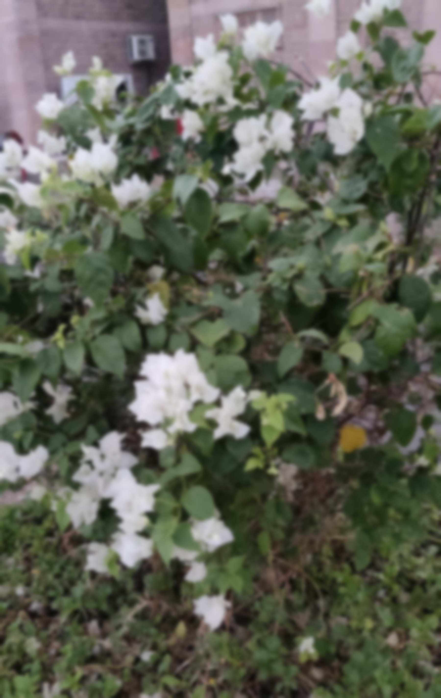

# SRGAN-PyTorch

## Overview

This repository contains an op-for-op PyTorch reimplementation of [Photo-Realistic Single Image Super-Resolution Using a Generative Adversarial Network](https://arxiv.org/abs/1609.04802v5).


Please refer to `README.md` in the `data` directory for the method of making a dataset.

## How Train and Test

Both training and testing only need to modify the `srgan_config.py` file. 


### Train SRGAN model

- line 31: `d_arch_name` change to `discriminator`.
- line 32: `g_arch_name` change to `srresnet_x4`.
- line 39: `upscale_factor` change to `4`.
- line 41: `mode` change to `train`.
- line 43: `exp_name` change to `SRGAN_x4-DIV2K`.
- line 58: `pretrained_g_model_weights_path` change to `./results/SRResNet_x4-DIV2K/g_last.pth.tar`.

```bash
python3 main.py
```

### Test

Modify the `srgan_config.py` file.

- line 32: `g_arch_name` change to `srresnet_x4`.
- line 39: `upscale_factor` change to `4`.
- line 41: `mode` change to `test`.
- line 43: `exp_name` change to `SRGAN_x4-DIV2K`.
- line 96: `g_model_weights_path` change to `./results/pretrained_models/SRGAN_x4-ImageNet-8c4a7569.pth.tar`.

```bash
python3 test.py
```


## Result

Source of original paper results: [https://arxiv.org/pdf/1609.04802v5.pdf](https://arxiv.org/pdf/1609.04802v5.pdf)

In the following table, the psnr value in `()` indicates the result of the project, and `-` indicates no test.

| Tree images | Scale |       SRGAN        |
|:-----------:|:-----:|:------------------:|
| PSNR        |   4   |  29.40(**30.64**)  |
| SSIM        |   4   |  0.8472(**0.8642**)|


### Result On image
```bash
python3 ./inference.py
```

Input: 

<span align="center"></span>

Output: 

<span align="center"></span>


```
